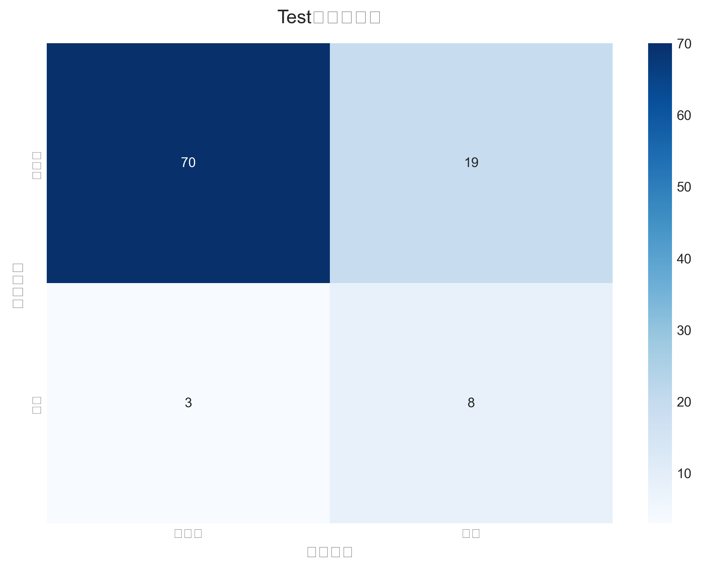
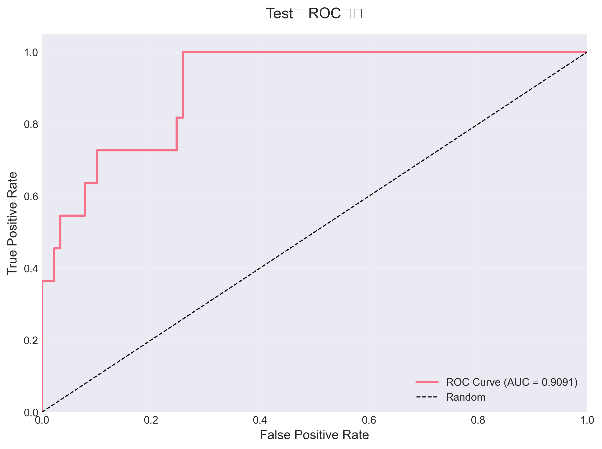
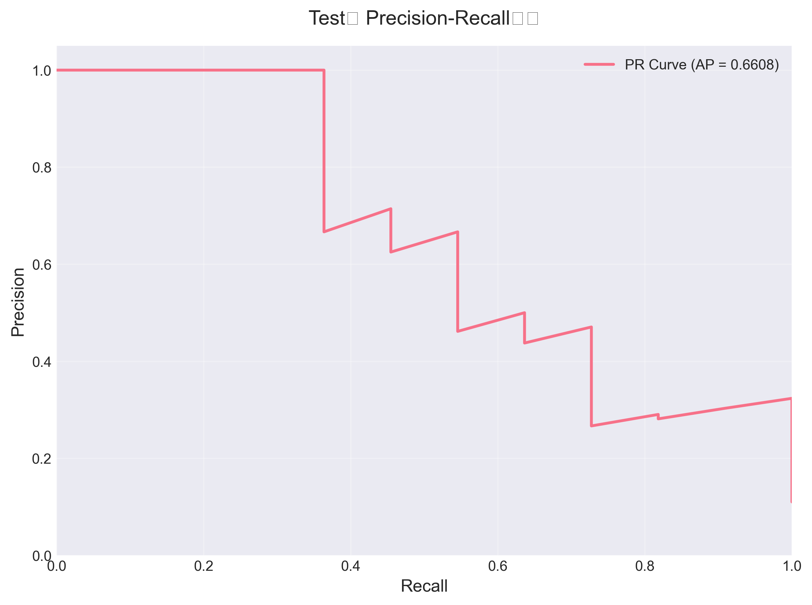

# Test集评估报告

## 性能指标

| 指标 | 数值 |
|------|------|
| Accuracy | 0.7800 |
| Precision | 0.2963 |
| Recall | 0.7273 |
| F1 Score | 0.4211 |
| AUC-ROC | 0.9091 |
| Average Precision | 0.6608 |

## 可视化结果

### 混淆矩阵

### ROC曲线

### Precision-Recall曲线

---
报告生成时间: 2025-10-18T13:48:42
